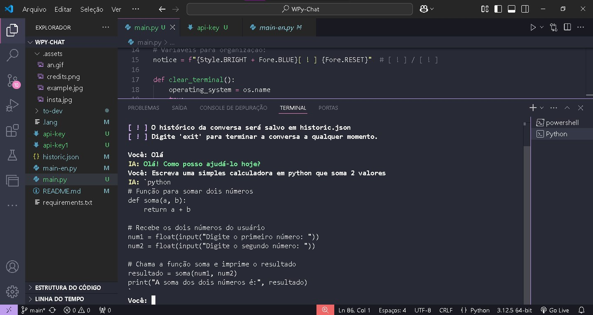
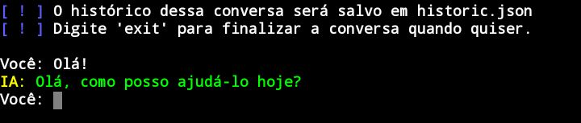

image:
  align: "center"
  alt: "C"
  src: "https://raw.githubusercontent.com/MicaelliMedeiros/micaellimedeiros/master/image/computer-illustration.png"


# WPy-Chat

O **WPy-Chat** é um programa feito em Python que consiste em um chat entre o usuário e um modelo de linguagem do Google, a IA Gemini. Com ela, você pode conversar com a IA ou integrá-la em seu projeto.

O código utiliza a biblioteca *google-generativeai* para integrar esse modelo de linguagem.

### Antes de executar o script, certifique-se de ter a chave de API necessária. 
### Para obtê-la, acesse o site de API de modelos de Linguagem do Google 
### [clicando aqui](https://aistudio.google.com/app/apikey) e gere gratuitamente um token. 
### Em seguida, insira seu token na variável `API_KEY` no script.

O arquivo **chat.py** está bem customizado. No entanto, se preferir o script sem customizações, dentro da pasta *to-devs*, você encontrará o **main.py**, sem modificações e direto ao ponto. Uso 100% livre!

**Chave de API:**
Para o script funcionar, você deve acessar o site da API de modelos de Linguagem do Google e gerar gratuitamente um token. Depois disso, insira seu token na variável `API_KEY` no script.

## Como instalar

### Windows:



1. **Baixe o código:** Clique no botão "Code" no GitHub e escolha a opção "Download ZIP". Extraia o conteúdo do arquivo ZIP para uma pasta de sua escolha.

2. **Instale as dependências:** Abra o prompt de comando na pasta onde você extraiu os arquivos e execute o seguinte comando para instalar as dependências:

    ```bash
    pip install -r requirements.txt
    ```

3. **Execute o programa:** Use o seguinte comando no prompt de comando para iniciar o WPy-Chat:

    ```bash
    python chat.py
    ```

4. **Script sem customizações:** Se preferir o script sem customizações, na pasta *to-devs*, você encontrará o **main.py**, sem modificações e direto ao ponto.

### Linux:

1. **Baixe o código:** Clone o repositório com o seguinte comando:

    ```bash
    git clone https://github.com/Wandson-Dev/WPy-Chat.git
    ```

2. **Instale as dependências:** Navegue até a pasta do projeto e execute o seguinte comando:

    ```bash
    pip install -r requirements.txt
    ```

3. **Execute o programa:** Utilize o seguinte comando para iniciar o WPy-Chat:

    ```bash
    python chat-pt.py ou python chat-en.py
    ```

4. **Script sem customizações:** Para a versão sem modificações, dentro da pasta *to-devs*, você encontrará o **main.py**, direto ao ponto.

### Termux:



1. **Instale o Termux:** Baixe e instale o [Termux](https://play.google.com/store/apps/details?id=com.termux).

2. **Abra o Termux:** Execute os seguintes comandos para instalar o Git e o Python:

    ```bash
    termux-setup-storage
    apt update && apt upgrade -y
    pkg install git
    pkg install python
    ```

3. **Baixe o código:** Clone o repositório com o seguinte comando:

    ```bash
    git clone https://github.com/Wandson-Dev/WPy-Chat.git
    ```

4. **Instale as dependências:** Navegue até a pasta do projeto e execute o seguinte comando:

    ```bash
    pip install -r requirements.txt
    ```

5. **Execute o programa:** Utilize o seguinte comando para iniciar o WPy-Chat:

    ```bash
    python main.py ou main-en.py
    ```

6. **Script sem customizações:** Para a versão sem modificações, dentro da pasta *to-devs*, você encontrará o **main.py**, direto ao ponto.

## Suporte Multilíngue

O código do **WPy-Chat** está disponível em Português (*main.py*) e Inglês (*main-en.py*), mas a IA está disponível em qualquer idioma. Atualmente, as strings do script estão disponíveis apenas em português e inglês. Em breve, será implementado um código unificado que traduzirá automaticamente o script para o idioma do ambiente em que está sendo executado. Aguarde por essa atualização para uma experiência ainda mais versátil.

